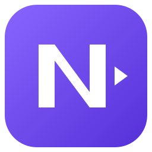

# NexPlay



[](https://github.com/Zimonxx/nexplay/actions/workflows/windows-ci.yml)
[](https://github.com/Zimonxx/nexplay/actions/workflows/release.yml)

NexPlay to lekka nagrywarka powtórek dla Windows, korzystająca ze sprzętowego kodowania NVIDIA NVENC. Program stale przechowuje ostatni fragment rozgrywki w buforze tymczasowym, a po użyciu skrótu zapisuje go jako klip i od razu rozpoczyna nowy bufor.

## Funkcje

- sprzętowe kodowanie H.264 przez NVIDIA NVENC,
- przechwytywanie całego monitora ustawionego jako główny,
- natywna rozdzielczość monitora, również do 8K,
- konfigurowalny FPS, bitrate i długość bufora od 10 sekund do 20 minut,
- bufor powtórek przechowywany w katalogu tymczasowym systemu,
- zapis klipu i wyzerowanie bufora jednym globalnym skrótem,
- oddzielna ścieżka audio dla każdej aktywnej aplikacji oraz mikrofonu,
- łączenie wybranych aplikacji w jedną nazwaną ścieżkę audio,
- możliwość wykluczania wybranych aplikacji i mikrofonu z nagrania,
- zapamiętywanie wykluczeń aplikacji po restarcie, wyłączone źródła na dole listy i automatyczne odświeżanie listy audio,
- globalne skróty działające również wtedy, gdy NexPlay jest aktywnym oknem,
- zmiana lub niezależne wyłączanie skrótów i zmiana koloru akcentu w ustawieniach,
- ciche powiadomienia zapisu z procentem postępu, wyborem rogu ekranu i obsługą kilku klipów naraz,
- automatyczne uruchamianie z Windows i automatyczny start bufora,
- biblioteka klipów w formie siatki z miniaturami przechowywanymi w pamięci,
- podgląd klatka po klatce podczas przesuwania kursora po miniaturze,
- wbudowany odtwarzacz z przewijaniem, pełnym ekranem i skrótami klawiaturowymi,
- kliknięcie obrazu zatrzymuje lub wznawia odtwarzanie,
- menu kontekstowe klipów, zmiana nazwy i otwieranie lokalizacji pliku,
- prosty edytor do przycinania początku i końca klipu,
- usuwanie zaznaczonego fragmentu ze środka i składanie pozostałości w jeden klip,
- wspólny timeline V1/A1–An z jedną skalą czasu, wyciszaniem i zakresem słyszalności ścieżek,
- opcja połączenia końcowej edycji w jedną ścieżkę audio,
- wspólne przycinanie obrazu i dźwięku, usuwanie ścieżek z montażu i cofanie usunięcia przez `Ctrl+Z`,
- eksport z dekodowaniem NVDEC i kodowaniem NVENC na GPU oraz procentowym paskiem postępu,
- ciemny interfejs studia z boczną nawigacją, panelem eksportu i konfigurowalnym akcentem,
- responsywne okno: siatka klipów i timeline dopasowują się do dostępnego miejsca, bez rozciągania ikon i checkboxów,
- maksymalizacja do obszaru roboczego Windows i przywracanie rozmiaru okna.

## Wymagania

- Windows 11 x64,
- karta NVIDIA obsługująca NVENC i aktualny sterownik NVIDIA,
- FFmpeg jest dołączony do instalatora i ZIP-a; osobna instalacja nie jest potrzebna,
- mikrofon i urządzenia audio widoczne w ustawieniach dźwięku Windows.

NexPlay korzysta z NVENC do kodowania obrazu. Zakres obsługiwanych rozdzielczości, liczby klatek i bitrate'u zależy od możliwości konkretnej karty graficznej, sterownika i monitora.
Nagrywanie na kartach AMD i Intel nie jest obsługiwane. Windows w edycji N wymaga składników multimedialnych Media Feature Pack.

## Instalacja i uruchomienie

1. Pobierz **Setup-windows-x64.exe** z sekcji [Releases](https://github.com/Zimonxx/nexplay/releases/latest).
2. Uruchom instalator. Program instaluje się dla bieżącego użytkownika, bez wymagania praw administratora; skrót na pulpicie jest opcjonalny.
3. Alternatywnie pobierz **windows-x64.zip** i rozpakuj całość. Katalog `tools` musi pozostać obok `nexplay.exe`.
4. Uruchom `nexplay.exe`.
5. Ustaw długość bufora, FPS i bitrate oraz wybierz źródła audio.
6. Kliknij **Uruchom bufor**.

Wydanie 0.2.0 nie jest podpisane certyfikatem wydawcy, więc Windows może wyświetlić ostrzeżenie. Nie wyłączaj ochrony systemu. Pobieraj program z oficjalnego repozytorium; sumę pliku można porównać z `SHA256SUMS.txt` za pomocą `Get-FileHash -Algorithm SHA256 <plik>`.

Zamknięcie okna chowa NexPlay do zasobnika. Przed ręcznym użyciem instalatora lub odinstalowaniem poczekaj na zapis klipów i wybierz **Zakończ** w menu ikony. Aktualizacja zachowuje ustawienia, a odinstalowanie pozostawia nagrania i ustawienia użytkownika. Autostart i automatyczny bufor włącza się osobno w aplikacji — instalator nie włącza nagrywania sam.

### Źródła audio

Odznacz program w sekcji **Źródła audio**, aby wykluczyć jego dźwięk. Wiersz trafia pod włączone źródła. Wybór zapisuje się od razu i obejmuje wszystkie procesy o tej samej nazwie pliku EXE, niezależnie od wielkości liter i numeru procesu. Zaznacz program ponownie, aby usunąć wykluczenie. Jeśli Windows nie pozwala odczytać nazwy programu, aplikacja informuje, że wybór dotyczy tylko bieżącego procesu.

Lista aktywnych źródeł odświeża się w tle co około 2 sekundy, również w trayu. Zniknięcie programu nie usuwa jego wykluczenia. Podczas pracy bufora nowe źródła są dołączane przy następnym zapisie klipu i wyzerowaniu bufora; sama aktualizacja listy nie resetuje nagrania. Zmianę wyboru źródeł wykonuj przy zatrzymanym buforze. Ustawienie mikrofonu jest zapamiętywane niezależnie.

### Aktualizacje w aplikacji

Od wersji 0.2.3 NexPlay sprawdza stabilne wydania w oficjalnym repozytorium po uruchomieniu i co 24 godziny, także w zasobniku. Nowa wersja wywołuje ciche powiadomienie Windows i oznaczenie zakładki **Aktualizacje**. Automatyczne sprawdzanie można wyłączyć; przycisk ręcznego sprawdzania pozostaje dostępny.

Wybierz **Pobierz aktualizację**, aby pobrać paczkę ZIP z procentowym postępem. Program weryfikuje SHA-256 z GitHub Releases, zawartość archiwum, wersję programu i działanie dołączonych narzędzi. Następnie zatrzymaj bufor, zakończ eksport i wybierz **Zaktualizuj i uruchom ponownie**. Zmiany montażu należy wcześniej wyeksportować. Pliki zostaną podmienione po zamknięciu programu, bez uruchamiania instalatora; NexPlay otworzy się ponownie.

Mechanizm działa dla instalacji użytkownika i rozpakowanej wersji ZIP w zapisywalnym folderze. Nie zmienia nagrań, ustawień ani plików deinstalatora. Przy błędzie podmiany próbuje przywrócić poprzednie pliki; kopie odzyskiwania i status są w `%LOCALAPPDATA%\NexPlay\Updates`. Kontrola SHA-256 wykrywa uszkodzenie pobrania, ale nie zastępuje podpisu cyfrowego wydawcy. Sprawdzanie łączy się z API GitHuba; nie wysyła nagrań ani ustawień.

Wersje 0.2.3–0.2.5 mają błąd odczytu listy plików w systemowym PowerShell: pobieranie działa, ale podmiana zatrzymuje się z komunikatem `Unexpected package path`. Poprawki aktualizatora są zawarte w 0.2.7. Aby przejść ze starszej wersji bez instalatora, zakończ NexPlay i wypakuj **całą zawartość folderu NexPlay z ZIP-a 0.2.7 lub nowszego** do folderu programu, zastępując pliki aplikacji (nie usuwaj folderu ani nagrań). Następnie uruchom `nexplay.exe`. Dla domyślnej instalacji folder programu to `%LOCALAPPDATA%\Programs\NexPlay`. Z 0.2.6 można już przejść na 0.2.7 z aplikacji; kolejne opublikowane wydania również instaluje się w ten sposób.

Domyślne skróty globalne:

- `F8` — zapisz ostatni fragment i wyzeruj bufor,
- `F9` — zatrzymaj nagrywanie.

Skróty można zmienić w ustawieniach. Przełącznik obok każdego skrótu wyłącza go bez usuwania zapisanej kombinacji; przyciski aplikacji i menu w zasobniku nadal działają. Klawisze nie są blokowane innym aplikacjom.

Aby ustawić kombinację, kliknij skrót **Zapisz klip**, przytrzymaj np. **prawy Shift** i naciśnij **Page Down**. Zapisany `RShift + Page Down` działa tylko po naciśnięciu tej kombinacji — sam Page Down ani lewy Shift jej nie aktywuje. Tak samo rozróżniane są lewy i prawy Ctrl oraz Alt. Starsze skróty zapisane jako ogólny `Shift`, `Ctrl` lub `Alt` pozostają zgodne z obiema stronami.

W sekcji **Powiadomienia zapisu** wybierz jeden z czterech rogów głównego monitora. Po zleceniu zapisu pojawi się cichy toast z procentem przygotowania danych i postępem FFmpeg. Kilka zapisów tworzy stos osobnych powiadomień. Po ukończeniu tekst **Zapisano klip** pozostaje widoczny przez 2 sekundy, a potem płynnie znika. Komunikat błędu pozostaje przez 5 sekund. Powiadomienia nie przejmują fokusu i są wykluczone z przechwytywanego obrazu.

NexPlay może działać w tle w zasobniku systemowym. Zapisane klipy trafiają domyślnie do:

```text
%USERPROFILE%\Videos\NexPlay\Clips
```

Roboczy bufor nagrania jest przechowywany w:

```text
%TEMP%\NexPlay\ReplayBuffer
```

## Biblioteka i edycja klipów

Zakładka **Biblioteka** pokazuje nagrania w siatce, której liczba kolumn zależy od szerokości okna. Przesunięcie kursora po miniaturze pozwala podejrzeć dokładną klatkę odpowiadającą pozycji kursora. Kliknięcie otwiera klip w odtwarzaczu, a prawy przycisk myszy udostępnia najważniejsze operacje na pliku.

W odtwarzaczu można przewijać nagranie bez jego modyfikowania, przełączyć obraz na pełny ekran i sterować odtwarzaniem klawiaturą. Podgląd znajduje się nad wspólnym timeline obrazu i dźwięku, a po prawej jest panel eksportu.

- Kliknij obraz lub naciśnij `Spację`, aby zatrzymać albo wznowić film.
- Kliknij podziałkę czasu, aby przewinąć bez zmiany zakresu klipu.
- Przeciągnij uchwyty **V1**, aby ustawić początek i koniec obrazu **razem z audio**. Zakresy dźwięku na timeline i w odsłuchu podążają za obrazem; wcześniejsze indywidualne przycięcia audio pozostają zachowane.
- W panelu eksportu przełącz **Przycinanie brzegów** na **Wycinanie fragmentu**, aby usunąć zaznaczony środek z obrazu i wszystkich ścieżek audio oraz połączyć pozostałości w jeden plik.
- Checkboxy **A1–An** wyciszają ścieżki w podglądzie i eksporcie, zachowując cichą ścieżkę w pliku. **Kosz obok nazwy** usuwa ścieżkę z timeline i eksportowanego MP4. `Ctrl+Z` przywraca ostatnio usuniętą ścieżkę (poza polem nazwy pliku). Oryginalne nagranie pozostaje nietknięte.
- Uchwyty audio określają dodatkowy słyszalny zakres wewnątrz cięcia V1, również na pełnym ekranie. Przewiń listę kółkiem myszy, aby zobaczyć kolejne ścieżki.
- Wpisz nazwę nowego pliku, opcjonalnie włącz **Jedna ścieżka audio** i wybierz **Eksportuj · GPU**. Oryginał pozostaje bez zmian.

Przycisk **Eksportuj · GPU** pokazuje rzeczywisty procent postępu FFmpeg oraz pasek. Do zakończenia zapisu i zatwierdzenia pliku postęp nie przekracza 99%; 100% oznacza gotowy plik. Nie można przypadkowo uruchomić drugiego eksportu, gdy pierwszy trwa.

Obraz jest dekodowany przez **NVDEC** i kodowany przez **NVENC**, z klatkami w pamięci GPU. Dźwięk AAC, miksowanie i obsługa pliku nadal wykorzystują CPU. Wymagana jest karta NVIDIA i FFmpeg z NVDEC/NVENC; błąd eksportu nie uruchamia cichego kodowania programowego. Przy aktualizacji własnego buildu trzeba zaktualizować również katalog `tools/ffmpeg/bin`, nie tylko plik EXE.

## Budowanie ze źródeł

Do zbudowania projektu potrzebne są:

- Visual Studio 2022 lub Build Tools 2022 z pakietem **Desktop development with C++**,
- CMake 3.24 lub nowszy,
- Ninja albo generator Visual Studio,
- Git z obsługą submodułów.
- PowerShell 7 (lub Windows PowerShell do samego wygenerowania ikony).

Pobierz repozytorium razem z submodułami:

```powershell
git clone --recurse-submodules https://github.com/Zimonxx/nexplay.git
cd nexplay
```

Jeżeli repozytorium zostało pobrane bez submodułów:

```powershell
git submodule update --init --recursive
```

Konfiguracja, kompilacja i testy wersji Release:

```powershell
cmake --preset windows-x64-release
cmake --build --preset windows-x64-release
ctest --test-dir out/build/windows-x64-release -C Release --output-on-failure
```

Jeśli FFmpeg jest dostępny w `PATH` podczas konfiguracji, testy sprawdzają również
rzeczywistą zawartość ścieżek audio na syntetycznych MP4: odwróconą kolejność,
identyczne nazwy, różne identyfikatory i przewijanie. Nie wymagają głośników,
nie odtwarzają dźwięku i nie korzystają z nagrań użytkownika.

Gotowy program znajduje się w:

```text
out\build\windows-x64-release\Release\nexplay.exe
```

Własny build korzysta z FFmpeg i FFprobe w `PATH` albo z katalogu `tools/ffmpeg/bin` obok programu. Oficjalne paczki zawierają oba narzędzia. Kodowanie używa sterownika NVIDIA zainstalowanego w systemie; nie jest on dołączany do paczki.

Konfiguracja Debug:

```powershell
cmake --preset windows-x64-debug
cmake --build --preset windows-x64-debug
ctest --test-dir out/build/windows-x64-debug -C Debug --output-on-failure
```

### Kontrola układu interfejsu

Dodatkowy cel deweloperski sprawdza geometrię paneli, proporcje miniatur i zgodność obszarów kliknięcia. Renderuje 12 podglądów czterech zakładek w trzech rozmiarach oraz podglądy menu klipów i tworzenia grupy audio, używając tego samego renderera co aplikacja:

```powershell
cmake --build --preset windows-x64-release --target nexplay_ui_preview
./out/build/windows-x64-release/Release/nexplay_ui_preview.exe ./out/ui-preview
```

Podglądy zawierają dane testowe. Narzędzie nie otwiera okna, nie nagrywa ekranu i nie instaluje skrótów. Nie zastępuje ręcznej kontroli odtwarzania ani systemowych animacji okna.

Opcjonalne testy eksportu wymagają GPU NVIDIA i FFmpeg z NVDEC/NVENC. Tworzą własne syntetyczne nagrania bez dostępu do ekranu, mikrofonu ani klipów użytkownika. Sprawdzają zawartość i czas audio po przycięciu, wycięciu środka, usunięciu, wyciszeniu i miksowaniu ścieżek oraz postęp eksportu:

```powershell
./out/build/windows-x64-release/Release/nexplay_ui_preview.exe ./out/editor-export-checks --export-tests
```

Opcjonalny argument `--window-frame` uruchamia dodatkowo test geometrii ramki na osobnym, niewidocznym oknie, bez uruchamiania nagrywarki. Zamiast tej opcji można podać ścieżkę do krótkiego pliku testowego MP4 (co najmniej 61 klatek), aby porównać miniatury z pełnym dekodowaniem przez FFmpeg.

Argument `--playback-tests` sprawdza rzeczywisty start audio, pauzę, przewijanie i wyciszenia na syntetycznym, bezgłośnym klipie. Wymaga dostępnego urządzenia wyjściowego Windows. Argument `--muted-playback=C:/ścieżka/klip.mp4` sprawdza start i synchronizację własnego dłuższego pliku przy wyciszonym dźwięku oraz mierzy odczyty dyskowe; nie modyfikuje nagrania.

Zapis klipów i eksport pozostawiają indeks MP4 na końcu pliku, aby nie przepisywać całego nagrania podczas finalizacji. Gotowy plik działa w lokalnych odtwarzaczach; odtwarzanie przez WWW przed pobraniem całego pliku może wymagać przygotowania go przez serwis hostingowy.

Podgląd zawiera też plik `save-toasts.png` z powiadomieniami zapisu. Opcjonalny cel
`save_toast_native_tests` sprawdza rzeczywiste nakładki: wyświetla na chwilę dwa
syntetyczne, bezgłośne toasty, bez nagrywania ekranu i tworzenia klipów. Nie należy
do domyślnego zestawu testów, ponieważ pokazuje okna na pulpicie.

## Wydania

### Budowanie instalatora i ZIP-a

Po zbudowaniu aplikacji uruchom w PowerShell 7:

```powershell
./release/Build-FFmpeg.ps1
./release/Build-Package.ps1 -TestInstaller
```

Pierwszy skrypt buduje ograniczony do potrzeb NexPlay wariant FFmpeg 9.0.1 z oficjalnych źródeł, bez GPL/nonfree i z bibliotekami współdzielonymi LGPL. Pobiera przypięte wersje narzędzi i sprawdza SHA256. Drugi instaluje kompilator Inno Setup 6.7.3 w `out/tools` (dla bieżącego użytkownika), tworzy instalator, ZIP, paczkę źródeł FFmpeg i sumy kontrolne w `out/dist`. Narzędzia do budowania nie trafiają do paczki aplikacji.

`-TestInstaller` dodatkowo testuje instalację, aktualizację i odinstalowanie na osobnym identyfikatorze produktu, katalogu i kluczach testowych. Nie zmienia autostartu NexPlay ani nagrań. Program obsługuje też `nexplay.exe --verify-installation`: sprawdza ikonę i dołączone narzędzia bez okna, nagrywania i dostępu do mikrofonu; kod wyjścia 0 oznacza powodzenie.

### Publikacja

Tag w formacie `vX.Y.Z`, zgodny z wersją w `CMakeLists.txt`, uruchamia budowanie i testy, a następnie publikuje instalator, ZIP, odpowiadające źródła FFmpeg i SHA256 na GitHubie:

```powershell
git tag v0.2.8
git push origin v0.2.8
```

Przepływ można ponowić w **Actions**, podając istniejący tag. Istniejące publiczne wydanie nie jest automatycznie nadpisywane. Zwykły CI udostępnia sam plik EXE jako artefakt deweloperski; pełna paczka użytkowa znajduje się w Releases.

Alternatywnie, po lokalnym zbudowaniu i przetestowaniu pełnych paczek oraz wysłaniu commita na `main`, można opublikować je bez korzystania z mocy obliczeniowej GitHub Actions:

```powershell
./release/Publish-Release.ps1 -PackageDirectory out/dist
```

Skrypt korzysta z `GH_TOKEN`, `GITHUB_TOKEN` lub skonfigurowanego menedżera poświadczeń Git. Tworzy wersję roboczą, przesyła paczki, sprawdza ich sumy z GitHubem i dopiero wtedy publikuje komplet jako najnowsze wydanie. Nie uruchamia instalatora i nie nadpisuje istniejącego publicznego wydania. Sam push kodu nie udostępnia aktualizacji użytkownikom — potrzebne jest opublikowane wydanie z ZIP-em.

## Licencja

Kod i oryginalna grafika NexPlay są dostępne na licencji [MIT](LICENSE). Zależności zachowują swoje licencje: [informacje o komponentach](release/THIRD-PARTY-NOTICES.txt). FFmpeg jest uruchamiany jako osobny proces; jego dokładne źródła, nagłówki NVIDIA i instrukcja kompilacji znajdują się obok binarnych paczek każdego wydania.
